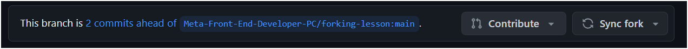

# gamio
Games so fun that they bring joy to heart 🥰
Website so beautiful that it brings tears to eyes 😭

## How to get started
1. Fork the og repo
2. clone the fork into your local machine 
2.1. Copy the GitHub repo link
2.2. Open Git Bash in a folder and type `git clone <repo-link>`
3. Open the folder in VSCode
4. In the terminal, write `npm install` to install all the dependencies
5. Yash pls write you react code in the folder: gamio > src > app > game > 1
6. Harshita pls write your code in: gamio > src > app > game > 2
7. the page.jsx file has already been made, just add your code there
8. if you use any components, please make them in src > components > game > 1 or 2 and then import it from there
9. once done with changes, commit and push to your fork
10. after that on the github page of your fork you will see this

8. click on contribute > open pull request.. just make pull request then I will merge it to the main repo

refer this for github doubts: https://www.youtube.com/watch?v=apGV9Kg7ics

If any other doubts pls lmk
